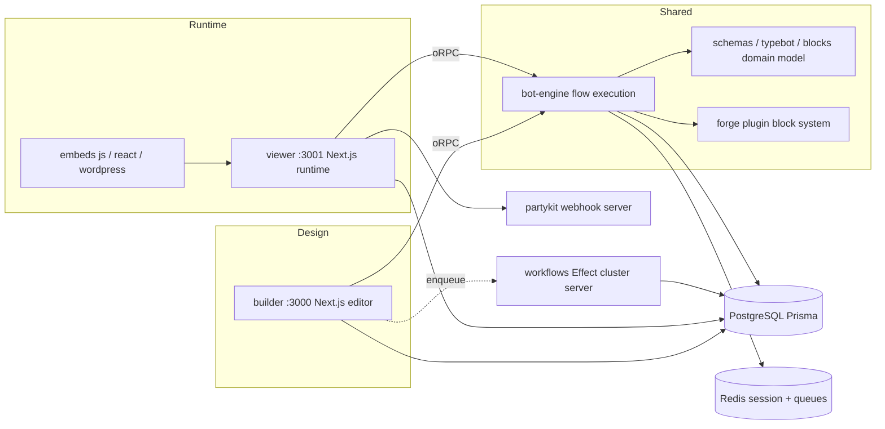

# Qinglbot Architecture Guide

This document captures how the codebase is structured and how the pieces fit
together, so future optimization and refactoring work can start from a shared
mental model. It is derived from reading source only (build output and
`node_modules` were intentionally ignored).

Qinglbot is a fork of the open-source **Typebot** chatbot builder. Internal
package names, imports, and the Prisma schema still use the `@typebot.io/*`
namespace, so treat "typebot" and "qinglbot" as the same product throughout.

## The Big Picture

Qinglbot is a visual chatbot builder plus a runtime that executes those bots.
A user designs a flow of connected "groups" and "blocks" in the **builder**,
publishes it, and end users then chat with the published bot through the
**viewer** (or an embed). The same execution engine (`bot-engine`) powers both
the in-builder preview and the public runtime.



## Monorepo Layout

Nx monorepo, Bun package manager, TypeScript project references. Workspaces are
declared in the root `package.json`: `apps/*`, `packages/*`,
`packages/services/*`, `packages/deprecated/*`, `packages/embeds/*`,
`packages/forge/*`, `packages/forge/blocks/*`, `packages/blocks/*`.

### Apps (`apps/`)

- `builder/` - The visual flow editor. Next.js (mixed App Router + Pages
  Router). Runs on port 3000 (dev command uses 8080). This is the largest app
  and hosts the primary API surface.
- `viewer/` - The runtime that serves and executes published bots for end
  users. Next.js, port 3001 (dev command uses 8081). Exposes the public chat
  API and embed-facing endpoints.
- `landing-page/` - Marketing site built with TanStack Start + Vite +
  content-collections (MDX-style content under `content/`).
- `landing-page-v0/` - An older/static landing build (the one shipped by
  `deploy.ps1` as `landing-v0`).
- `workflows/` - A standalone Bun server built entirely on **Effect** (v4 beta)
  and its cluster workflow engine. Runs durable background workflows such as
  results export and user onboarding emails. Deployed to Fly.io
  (`apps/workflows/fly.toml`).
- `docs/` - Documentation site.

### Packages (`packages/`)

Feature-driven and shared libraries. The important ones for architecture:

Domain model and flow:
- `schemas/` - Top-level typebot version constants and cross-feature schemas.
  Current `latestTypebotVersion` is `6.1`.
- `typebot/` - The core Typebot aggregate: schemas (`typebot`, `publicTypebot`,
  `edge`), migrations between versions (V3->V4, V5->V6), and a repository layer
  (`TypebotRepo`, `PrismaTypebotRepository`, `TypebotService`).
- `groups/` - "Group" is a node on the canvas that contains an ordered list of
  blocks. Schemas plus helpers like `getBlockById` and `parseGroups`.
- `blocks/` - The built-in block catalog, split by category:
  - `core/` - Base block schema and the `Block` union type (`BlockV5` /
    `BlockV6`), plus block migrations.
  - `bubbles/` - Output blocks (text, image, video, audio, embed).
  - `inputs/` - User input blocks (text, email, phone, buttons, picture choice,
    date, payment, file, cards...).
  - `logic/` - Conditions, redirects, scripting, A/B testing, typebot links.
  - `integrations/` - Legacy first-party integrations (OpenAI, Google Sheets,
    HTTP request, analytics, pixel...).
  - `fileInput/`, `webhook/`, `base/` - Specialized block packages.
- `events/` - Flow events (start, reply, invalid reply, command) with
  constants + schemas.
- `conditions/`, `variables/`, `theme/`, `settings/`, `rich-text/` - Supporting
  domain concerns used across builder, viewer, and engine.

Execution and sessions:
- `bot-engine/` - The heart of runtime execution (see next section).
- `chat-api/` - Shared request/response schemas for the chat API
  (`startChat`, `continueChat`, messages) and client-side action definitions.
- `chat-session/` - `SessionState` / `TypebotInSession` schemas describing the
  serialized state of an in-progress conversation.
- `runtime-session-store/` - Ephemeral per-request session store abstraction.
- `results/` - Persisted chat results/answers, plus Effect-based export
  workflows consumed by the `workflows` app.

Plugin block system:
- `forge/core/` - `createBlock` / `createAction` primitives, zod-based option
  layouts (`zodLayout`), and the runtime types for pluggable blocks.
- `forge/blocks/*` - One package per third-party integration block
  (anthropic, openai, deepseek, mistral, groq, perplexity, difyAi, elevenlabs,
  calCom, gmail, nocodb, zendesk, qrcode, and more). Each exports a block
  definition with `auth`, `options`, and `actions`.
- `forge/repository/` - Aggregates all forge blocks into `forgedBlocks`
  definitions and schemas consumed by builder and engine.
- `forge/cli/` - `bun start` scaffolder for creating a new forge block
  (`bun run create-new-block`).

Platform / infrastructure:
- `prisma/` - Database schema and client. Supports both `postgresql/` and
  `mysql/` schema variants; an Effect Prisma generator emits `.effect/index.ts`
  for Effect-based data access. Exposes `createPrismaAdapter` (NextAuth) and an
  Effect `PrismaService` layer.
- `config/` - Cross-cutting config: the oRPC `os` builder, context, and
  middlewares for both `builder` and `viewer`; workflow RPC protocol/secret;
  and Vitest test harness (`tests/` with a Postgres testcontainer, schema push,
  and DB seeding).
- `env/` - Zod-validated environment variables (compiled via esbuild in
  `postinstall`).
- `auth/`, `user/`, `workspaces/`, `spaces/`, `credentials/`, `billing/` -
  account, tenancy, and monetization concerns.
- `lib/` - Shared utilities including Redis, S3 upload, and Nodemailer clients
  (used as Effect layers by the workflows server).
- `telemetry/`, `logs/`, `radar/` - Observability, logging, and abuse/risk
  detection.
- `emails/` - Transactional email templates and senders.
- `whatsapp/` - WhatsApp channel integration (start/continue via WhatsApp).
- `embeds/` - Client embed libraries: `js` (framework-agnostic web
  components), `react`, `wordpress`, and `stories`.
- `ui/` - Shared UI component package.
- `partykit/` - A PartyKit `webhookServer` for realtime webhook delivery.
- `playwright/` - Shared Playwright setup for e2e tests.

## Domain Model

A **Typebot** is the design-time bot definition. Its published snapshot is a
**PublicTypebot**. The graph structure is:

```
Typebot
  |- groups: Group[]        // canvas nodes, positioned (graphCoordinates)
  |    \- blocks: Block[]   // ordered steps inside a group
  |- edges: Edge[]          // connections between block outputs and groups
  |- events: Event[]        // start event + reply/command events
  |- variables: Variable[]  // flow variables
  |- theme, settings        // appearance + behavior config
  \- version                // schema version, latest "6.1"
```

`Block` is a discriminated union (`packages/blocks/core/src/schemas/schema.ts`)
of start, bubble, input, logic, integration, and (in V6) **forged** blocks.
Versioning matters: `blockSchemaV5` vs `blockSchemaV6`, with migrations in
`packages/typebot/src/migrations` and `packages/blocks/core/src/migrations`.
When touching block shapes, always account for migrations and the version gate
helpers (`isTypebotAtLeastV6`, etc.).

### Persistence (Prisma)

Key models in `packages/prisma/postgresql/schema.prisma`:
`User`, `Workspace`, `Space`, `MemberInWorkspace`, `Typebot`, `PublicTypebot`,
`CollaboratorsOnTypebots`, `Result`, `Answer` / `AnswerV2`,
`SetVariableHistoryItem`, `VisitedEdge`, `Log`, `ChatSession`, `Credentials` /
`UserCredentials`, `CustomDomain`, `Webhook`, `ThemeTemplate`, `Coupon`,
`ClaimableCustomPlan`, `BannedIp`, `RuntimeMediaIdCache`. Tenancy flows
`Workspace -> Typebot -> Result`, with plans/limits on the workspace.

## Runtime Execution Flow (bot-engine)

The engine is framework-agnostic and shared by builder preview and viewer. Entry handlers live in `packages/bot-engine/src/api/`.

1. **Start** - `handleStartChat` / `handleStartChatPreview` call `startSession.ts`, which loads the (public) typebot, resolves the starting point (`getStartingPoint`), builds the initial `SessionState`, injects prefilled variables, then walks the flow forward.
2. **Walk forward** - `walkFlowForward.ts` traverses groups/blocks from a starting point. For each block it dispatches by category: bubble block -> `parseBubbleBlock` produces a chat message; input block -> `formatInputForChatResponse`, then it pauses to await the reply; logic block -> `executeLogic`; integration / forged block -> `executeIntegration`. It follows edges via helpers like `getNextBlock` / `getReplyOutgoingEdge` and records visited edges.
3. **Continue** - `handleContinueChat` reloads the session and calls `continueBotFlow.ts`, which validates and parses the incoming reply (`validateAndParseInputMessage`), updates variables (`updateVariablesInSession`), saves the answer (`queries/saveAnswer`), fires reply/invalid-reply/command events, and walks forward again.
4. **Persist** - `saveStateToDatabase.ts` writes the `ChatSession` state and results. Session state is versioned (`chat-session` schemas) and can hold multiple typebots on a stack (used by typebot links).
5. **Client-side actions** - responses can carry `clientSideActions` (`chat-api/clientSideAction.ts`): scripts, redirects, analytics/pixel events, and stream markers the embed executes in the browser.

Supporting concerns: `mediaCache/` (RuntimeMediaIdCache), `logs/` (chat logs), `computeResultTranscript.ts`, `parseDynamicTheme.ts`, and `forge/` glue for running forged-block actions inside the flow. Legacy V1/V2 `sendMessage` handlers are kept under `api/legacy/` for backward compatibility.

## API Layer (oRPC)

Both apps expose their API through oRPC, which gives typed procedures, an OpenAPI surface, and REST-style routes at once.

- The base `os` builder, request `Context`, and auth middlewares live in `packages/config/src/orpc/{builder,viewer}/`. Procedure variants: `publicProcedure`, `publicProcedureWithOptionalUser`, `authenticatedProcedure` (builder) and `protectedProcedure`, `procedureWithOptionalUser` (viewer). A Sentry middleware wraps everything; auth is resolved lazily via `context.authenticate()`.
- The builder root router is `apps/builder/src/app/api/router.ts` (`appRouter`), composed from many feature routers (`typebot`, `results`, `theme`, `workspace`, `collaborators`, `credentials`, `forge`, `billing`, `auth`, `chat`, integration routers, etc.). It is served at `apps/builder/src/app/api/orpc/[[...rest]]/route.ts`.
- Feature routers live next to their feature, e.g. `apps/builder/src/features/<feature>/api/router.ts`; shared engine and whatsapp routers live in their packages (`@typebot.io/bot-engine/api/router`).
- The public chat API (start/continue chat, save logs) is defined in `packages/bot-engine/src/api/router.ts` as `chatRouter` and mounted by the viewer under `apps/viewer/src/app/api/[[...rest]]/`.
- Streaming responses (LLM output) use dedicated route handlers at `app/api/v2/sessions/[sessionId]/streamMessage/route.ts` in both apps.
- Auth uses NextAuth v5 (`@auth/core` + `next-auth`) with the Prisma adapter; routes at `app/api/auth/[...nextauth]/route.ts`.

Convention: when adding an endpoint, define an oRPC procedure in the relevant feature `api/` folder, register it on the router, and let clients call it via the generated TanStack Query client (`@/lib/queryClient` `orpc`).

## Builder Editor Internals

The editor is organized under `apps/builder/src/features/`, one folder per feature (`editor`, `graph`, `blocks`, `typebot`, `theme`, `results`, `analytics`, `publish`, `collaboration`, `share`, `settings`, `variables`, `credentials`, `folders`, `workspace`, `forge`, `templates`, ...). Each feature typically bundles its components, hooks, `api/` procedures, and helpers.

State management for the bot being edited:
- `features/editor/providers/TypebotProvider.tsx` holds the current `TypebotV6` in React context, exposing granular action groups (`groupsActions`, `blocksAction`, `edgesAction`, `itemsAction`, `eventsActions`, `variablesAction`) under `features/editor/providers/typebotActions/`.
- Edits go through immer-style actions, an undo/redo stack (`useUndo`), and autosave (`useAutoSave`, 15s debounce) that persists via the oRPC `typebot` router. Publish diffs the draft against the `PublicTypebot` (`areTypebotsEqual`, `isPublished`).
- The canvas is a custom graph renderer under `features/graph/` (not a library): providers (`GraphProvider`, `GraphDndProvider`, `EndpointsProvider`), edge path math in `helpers/compute*`, drag-and-drop via `@dnd-kit`, and zoom/pan gestures via `@use-gesture/react`.
- Client data fetching is TanStack Query over oRPC. Zustand and `shared-zustand` back some cross-component UI stores (e.g. selection).
- i18n is Tolgee (`@tolgee/react`); locale sync scripts are in the root `package.json`.

## Frontends and Embeds

- Both `builder` and `viewer` are Next.js 16 / React 19 apps that mix the App Router (`src/app/`, mostly API + layouts) and Pages Router (`src/pages/`, most screens). The viewer's public bot page is `pages/[[...publicId]].tsx`.
- The chat UI is delivered as web components from `packages/embeds/js` (`register.ts` / `web.ts` register `<typebot-standard>`, `<typebot-bubble>`, `<typebot-popup>`). `@typebot.io/react` wraps them for React consumers, and the wordpress package wraps further. The builder consumes the same components through `@typebot.io/react` for its live preview.
- Styling uses Tailwind CSS v4 (via `@tailwindcss/postcss`).

## Background Workflows and Realtime

- `apps/workflows` is a pure-Effect Bun server. It composes Effect `Layer`s for Postgres (`@effect/sql-pg`), Prisma, Redis, S3, Nodemailer, and telemetry, and serves durable workflows over an RPC endpoint (`/rpc`, NDJSON) guarded by a shared `RPC_SECRET` header. Current workflows: `ExportResultsWorkflow`, `SendExportToEmailWorkflow`, `StartUserOnboardingWorkflow`. The apps enqueue work by calling this RPC; the workflow engine handles retries/durability.
- `packages/partykit` runs a PartyKit `webhookServer` for realtime webhook delivery to connected clients.
- Redis (`ioredis` / `@upstash/ratelimit`) backs chat-session storage, rate limiting, and queueing.

## Tooling and Conventions

Build / task runner:
- All scripts run through Nx with Bun: `bunx nx <target> <project>`. Most targets are inferred by Nx plugins (`@nx/js/typescript`, `@nx/next`, `@nx/vite`).
- Typecheck: root `bunx nx typecheck` runs `tsc --build --emitDeclarationOnly` across references; per-package `bunx nx typecheck <project>`; per-app it runs `tsc --noEmit`. Prefer IDE TS-server diagnostics first for speed.
- Sync TS project references with `bunx nx sync`. Never run plain `bunx tsc`.
- Dev: `bun dev` runs builder + viewer + workflows + partykit together.

Lint / format:
- Biome is the single formatter + linter: `bunx nx format-and-lint` (add `--write --unsafe` to autofix). Config in `biome.json`.
- `sherif` enforces monorepo dependency hygiene (`lint-repo`).
- Husky pre-commit runs `format-and-lint`, `lint-repo`, and broken-link checks on affected projects.

Testing:
- Vitest for unit/integration; Playwright for e2e (viewer).
- Each Nx test target spins up its own Vitest process and global setup, so do NOT run `bunx nx run-many -t test` or `affected -t test`. Instead run the shared root runner `bunx nx test`, or a single project through it with `bunx nx test <project-name>`.
- The shared global setup starts a Postgres testcontainer, pushes the Prisma schema, and seeds the DB (`packages/config/src/tests/`).
- For authenticated Playwright sessions, inject cookies from `apps/viewer/src/test/.auth/user.json` (remap to a minimal Playwright cookie shape scoped to `http://localhost:3000`; do not pass stored objects directly).

Coding style (from AGENTS.md):
- Prefer Effect (v4 beta). Inspect Effect source through `opensrc` starting from `LLMS.md`; do not guess at Effect patterns.
- Never use `as`; narrow/parse to the correct type. Lean on type inference and avoid declaring types unless needed.
- One primary exported function per file, file name matches it, main function at top and helpers at the bottom. Extract a helper only if used twice; declare a variable only if used twice; use very explicit names.
- Default to ASCII; use `trash` (not `rm`) to delete. Read a dependency''s real source with `bunx opensrc path <package>` rather than from `node_modules/`.

## Deployment

- Local dev and self-host use Docker Compose. `docker-compose.dev.yml` runs Postgres + Redis for development; `docker-compose.yml` runs the published builder/viewer images plus Postgres/Redis; `docker-compose.build.yml` builds prod images locally. A root `Dockerfile` builds the apps.
- This fork also has a Windows/PM2 deployment path: `deploy.ps1` builds Next.js standalone bundles for builder and viewer plus the static `landing-page-v0`, packs them into `*-deploy.tar.gz`, and `deploy/ecosystem*.config.js` + `deploy/nginx-qinglbot.conf` run them behind PM2 and Nginx on an ECS box. See `DEPLOYMENT_NOTES.md`, `ECS_DEPLOY.md`, and `ECS_CONNECTION.md` (note: several of these notes are in Chinese and contain mojibake in some views).
- The workflows server deploys separately to Fly.io (`bun run deploy-workflows`).
- Environment is driven by a single root `.env` (see `.env.example`). Required keys include `ENCRYPTION_SECRET`, `DATABASE_URL`, `REDIS_URL`, and the app URLs. `packages/env` validates them.

## Where To Look When Optimizing

- Bot runtime performance / behavior: `packages/bot-engine/src/` (`startSession`, `walkFlowForward`, `continueBotFlow`, `saveStateToDatabase`) and `packages/chat-session`.
- Editor UX / canvas performance: `apps/builder/src/features/graph/` and `apps/builder/src/features/editor/providers/` (autosave cadence, undo stack, re-render scope).
- API surface / new endpoints: `apps/builder/src/app/api/router.ts`, feature `api/router.ts` files, and `packages/config/src/orpc`.
- Data model changes: `packages/prisma/postgresql/schema.prisma` plus the matching schema in `packages/typebot`, `packages/blocks/*`, and migrations in `packages/typebot/src/migrations` (bump `latestTypebotVersion` in `packages/schemas/src/versions.ts` when the format changes).
- New integrations / AI providers: add a forge block under `packages/forge/blocks/<name>/` (scaffold with `bun run create-new-block`) and register it in `packages/forge/repository`.
- Embed / delivery size: `packages/embeds/js`.
- Background jobs: `apps/workflows/src/index.ts` and the `*/workflows/` folders in `packages/results` and `packages/user`.

## Caveats

- This is a fork; upstream Typebot docs (docs.typebot.io) are mostly accurate for architecture but branding, deployment, and some model/provider choices differ here.
- Build artifacts are committed in places (`deploy/dist`, `*-deploy.tar.gz`, per-package `dist/`). Treat those as generated output, not source.
- Some repo docs contain garbled non-ASCII text; rely on source code as the source of truth.
